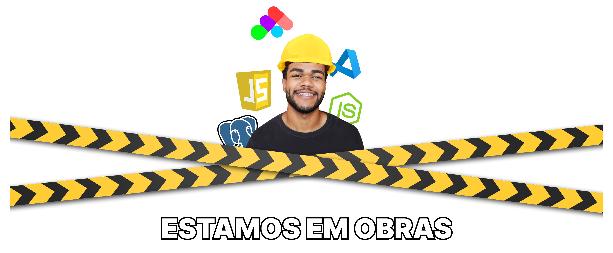
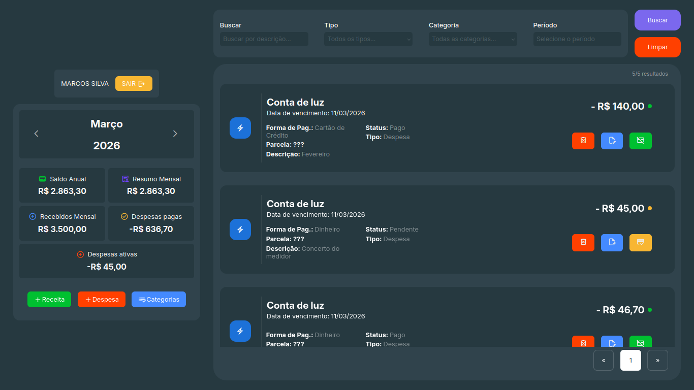
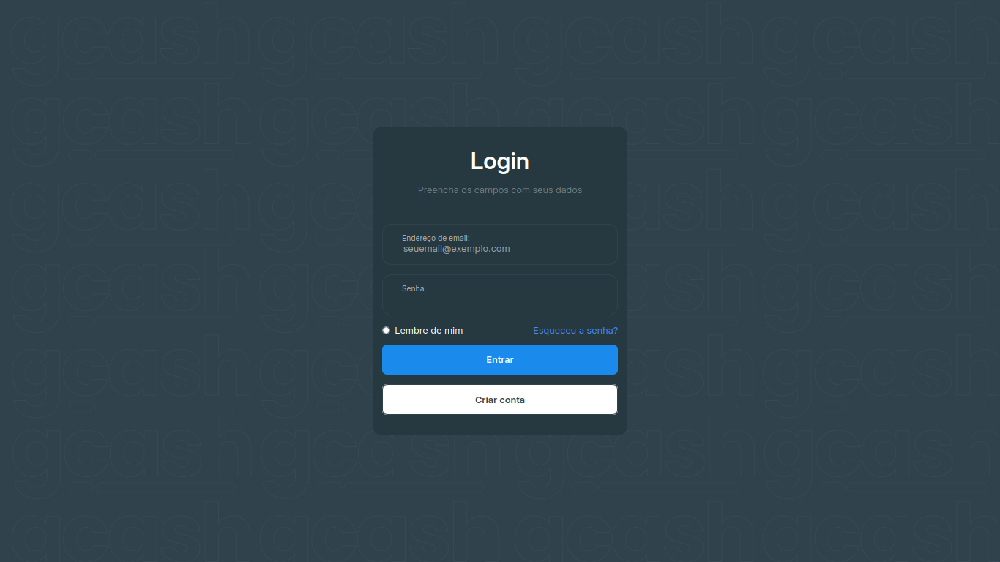
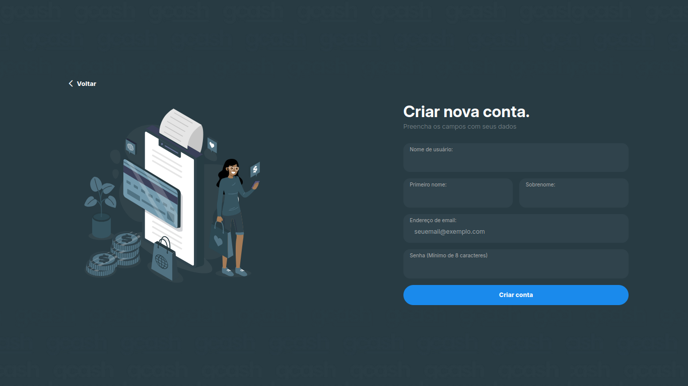

 

 

  <a href="#demo">Demo</a> |
  <a href="#objetivo">Objetivo</a> | 
  <a href="#funcionalidades">Funcionalidades</a> | 
  <a href="#arquitetura">Arquitetura</a> |
  <a href="#tecnologias">Tecnologias</a> | 
  <a href="#estrutura">Estrutura</a> |
  <a href="#roadmap">Roadmap</a>|
  <a href="#documentacao">Documentação</a> 

---

# 💰 GCASH — Gerenciador Financeiro Pessoal

Aplicação **Fullstack JavaScript** para gerenciamento de finanças pessoais, permitindo registrar receitas, despesas e acompanhar o histórico financeiro.

O projeto foi desenvolvido **do zero**, com foco em **fundamentos de desenvolvimento web**, arquitetura de software e integração completa entre **frontend, backend e banco de dados**.

---

# 🚀 Demo

🌐 **Aplicação online**

https://gcash-ten.vercel.app/login

**Usuário de teste**
EMAIL: MARCOSSILVA@GMAIL.COM
PASSWORD: MARCOSTESTE10

📦 **Repositório**

https://github.com/donizeti26/Gcash

📚 API Documentation  
https://gcash-xin5.onrender.com/api/docs/

⚠️ Observação

A API está hospedada no plano gratuito do Render.  
Se a aplicação ficar algum tempo sem acesso, o servidor pode entrar em modo "sleep".  
Nesse caso, o primeiro carregamento pode levar cerca de 30–60 segundos enquanto o servidor é reativado.

# 🎯 Objetivo

O GCASH foi desenvolvido com dois objetivos principais:

### 1️⃣ Resolver um problema real

Permitir que usuários tenham **controle claro sobre receitas, despesas e histórico financeiro**, facilitando o planejamento financeiro.

### 2️⃣ Consolidar fundamentos de engenharia de software

Durante o desenvolvimento foram praticados conceitos importantes como:

- Arquitetura **MVC**
- Criação de **API REST**
- Integração **frontend ↔ backend**
- Modelagem de **banco de dados PostgreSQL**
- Deploy em **cloud**
- Manipulação direta do **DOM com Vanilla JavaScript**

O projeto evita frameworks pesados para priorizar **aprendizado profundo dos fundamentos da web**.

---

# 🧩 Funcionalidades

✔ Cadastro de receitas e despesas  
✔ Controle de status (pago / pendente)  
✔ Registro de forma de pagamento  
✔ Organização por categorias  
✔ Resumo financeiro mensal  
✔ Histórico completo de transações  
✔ Filtros por período, tipo e categoria  
✔ Interface simples focada em produtividade

---

# 🖥️ Interface

### Dashboard

### Login

### Cadastro

---

# 🧠 Arquitetura da Aplicação

O projeto segue uma arquitetura **MVC (Model–View–Controller)**.

### Camadas

**Frontend**

- Interface da aplicação
- Manipulação de DOM
- Requisições HTTP com Fetch API

**Backend**

- API REST
- Regras de negócio
- Comunicação com banco de dados

**Banco de dados**

- Armazenamento persistente
- Estrutura relacional em PostgreSQL

---

# 🛠️ Tecnologias e Ferramentas

## Frontend

- HTML5
- CSS3
- **JavaScript (Vanilla JS)**
- Fetch API
- Vite

## Backend

- Node.js
- Express
- Arquitetura MVC
- API REST

## Banco de dados

- PostgreSQL
- Neon (Serverless Postgres)

## Infraestrutura

- Vercel (deploy frontend)
- Render (deploy backend)

## Documentação

- Swagger (OpenAPI)

## Ferramentas

- Figma (UI/UX)
- Draw.io (diagramas)
- PgAdmin (gerenciamento do banco)

## Bibliotecas

- [Date Range Picker](https://www.daterangepicker.com/)
- [Material Symbols](https://fonts.google.com/icons)

---

# 📂 Estrutura do Projeto

GCASH
│
├── docs
│ ├── diagramas
│ ├── screenshots
│ └── prototipos
│
├── public
│ ├── css
│ ├── scripts
│ ├── assets
│ └── views
│
├── server
│ ├── src
│ │ ├── config
│ │ ├── controllers
│ │ ├── models
│ │ ├── routes
│ │ └── services
│
└── package.json

# 📌 Roadmap

### ✔ Concluído

- Frontend inicial
- Sistema de login
- CRUD de receitas e despesas
- Integração com banco PostgreSQL
- Estrutura MVC
- Deploy da aplicação
- Protótipo no Figma
- Modelagem do banco de dados

### 🚧 Em desenvolvimento

- Lógica de parcelamento
- Validações adicionais
- Melhorias na UX
- Ajustes na tela de login
- Paginação avançada

---

# 🎨 Design da Interface

Prototipação completa desenvolvida no **Figma**

👉 https://www.figma.com/design/faIoh8gXIKu4B9rTiptKfR/Interface-no-Figma--Gcash

---

# 📚 Documentação da API

A API do GCASH possui documentação interativa para facilitar testes e integração.

🔎 **Acessar documentação**

https://gcash-xin5.onrender.com/api/docs/

A documentação permite:

- visualizar todas as rotas da API
- testar requisições diretamente no navegador
- consultar parâmetros e respostas
- entender o fluxo de comunicação entre frontend e backend

A interface foi construída utilizando **Swagger**, padrão amplamente utilizado para documentação de APIs REST.

# ✍️ Autor

**Donizete Silva**

Projeto desenvolvido com foco em **aprendizado, prática de fundamentos e construção de portfólio profissional.**
